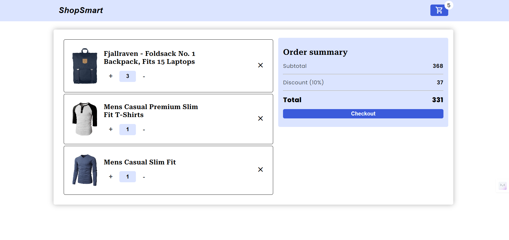

# 🛒 Add to Cart App with Modal – ReactJS + Fake Store API - Version 2

A modern, responsive ReactJS application that showcases products from the Fake Store API and allows users to add and manage items in a cart through an interactive modal interface. This app demonstrates effective state management, component communication, and responsive UI design using best practices.built with **React Router**

---

## 🚀 Features

- ✅ Fetch and display products using the Fake Store API.
- 🖼️ Beautiful and responsive layout to showcase product image, title, description, and price.
- ➕ Add items to the cart directly from the product page.
- ❌ Remove items from the cart, even if already added.
- 🔢 Increase/Decrease quantity of items in the cart.
- 💰 Real-time calculation of total price and quantity.
- 🎁 Apply a 10% discount on the final total.
- 🔁 Persistent and consistent cart state across routing.
- 🧭 Navigation between Product and Cart pages using React Router.

---
## 🔗 Live Demo

[View Live Demo](https://shoppingcart-webs-v2.netlify.app/) 

---

## 🖼️ Screenshots


---



---

## 📦 Tech Stack

- **Frontend:** ReactJS, React Hooks, CSS 
- **React Router** – For navigation.
- **API:** [Fake Store API](https://fakestoreapi.com/)
- **UI/UX:** Responsive design, modals, alert messages, icons

---

## 📱 Responsive Design

- Built with **mobile-first** principles
- Uses **Flexbox** and **Grid**
- Scales smoothly from small to large screens

---

## 🚀 How to Use

1. **Clone the Repo**
   ```bash
   git clone -b v2 git@github.com:CodeRamana/Shopping-cart.git
   cd Shopping-cart

---
### 🙌 Credits

Developed with ❤️ by [Ramana S](https://github.com/CodeRamana)

