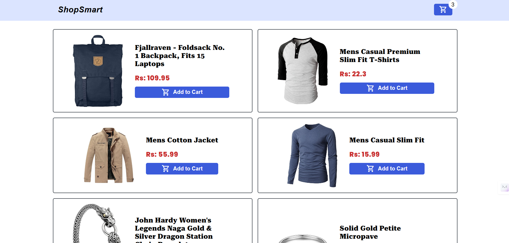
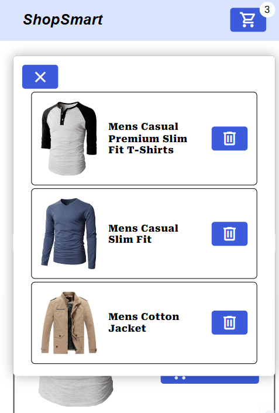

# 🛒 Add to Cart App with Modal – ReactJS + Fake Store API

A modern, responsive ReactJS application that showcases products from the Fake Store API and allows users to add and manage items in a cart through an interactive modal interface. This app demonstrates effective state management, component communication, and responsive UI design using best practices.

---

## 🚀 Features

- ✅ Fetch products from [Fake Store API](https://fakestoreapi.com/)
- 🛍️ Display product cards with image, title, price, and "Add to Cart" button
- 🔁 Add products to cart using modal interface
- ❗ Show alert if product is already added to the cart
- 🧾 Navbar with real-time cart item count
- 🪟 Modal that displays all cart items with a remove button
- ❌ Remove individual items from the cart
- 📱 Fully responsive layout (desktop & mobile)
- 🧩 Clean, modular component structure
- ✨ Smooth animations and polished user experience

---

## 🖼️ Screenshots



---



---

## 📦 Tech Stack

- **Frontend:** ReactJS, React Hooks, CSS 
- **API:** [Fake Store API](https://fakestoreapi.com/)
- **UI/UX:** Responsive design, modals, alert messages, icons

---

## 📱 Responsive Design

- Built with **mobile-first** principles
- Uses **Flexbox** and **Grid**
- Scales smoothly from small to large screens

---

## 🚀 How to Use

1. **Clone the Repo**
   ```bash
   git clone git@github.com:CodeRamana/Shopping-cart.git
   cd Shopping-cart

---
### 🙌 Credits

Developed with ❤️ by [Ramana S](https://github.com/CodeRamana)

